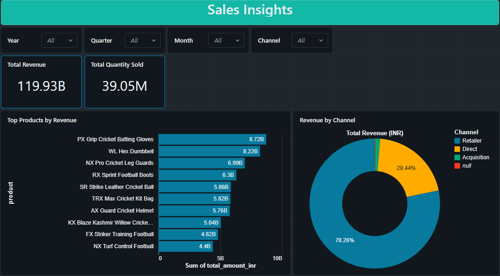
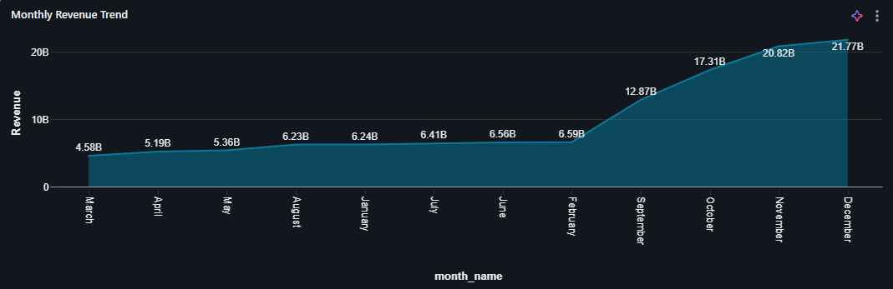
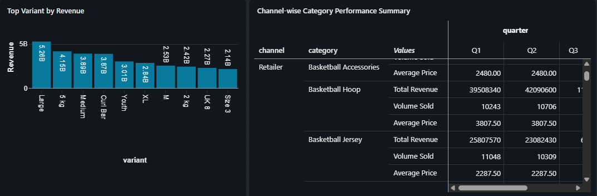

# 📊 Atlikon Unified Data Platform

## 🧩 Problem Statement

Atlikon, a global sporting equipment manufacturer, acquired Sports Bar—a fast-growing startup in the athletic nutrition space. While Atlikon operates on structured ERP systems, Sports Bar’s data is fragmented across spreadsheets, cloud storage, and informal exports.

This led to:

* Schema mismatches
* Inconsistent business metrics
* Missing historical data
* Misaligned reporting cycles

These issues blocked unified analytics for **supply chain, forecasting, and inventory planning**.

---

## 🎯 Project Goal

Design a **scalable and reliable data platform** that unifies data from both companies into a **single source of truth**.

* ERP data (parent) → already structured
* Startup data (child) → cleaned and standardized through pipeline

Both are unified in the **Gold layer** for consistent analytics.

---

## 🛠️ Tech Stack

* **Databricks** – Data processing & orchestration
* **PySpark (Python)** – Transformations
* **SQL** – Querying & aggregations
* **Amazon S3** – Data lake storage
* **Medallion Architecture** – Bronze → Silver → Gold

---

## 🏗️ Architecture Overview

### 🟤 Bronze (Raw)

* Ingest data from ERP, CSVs, and exports
* Preserve raw data for traceability

### ⚪ Silver (Cleaned)

* Standardize schema, column names, and data types
* Handle nulls and deduplicate records

### 🟡 Gold (Business Layer)

* Build KPIs and aggregated datasets
* Enable reporting and analytics

---

## ⚙️ Pipeline Orchestration

Pipelines are automated using **Databricks Jobs**:

```
Bronze → Silver → Gold
```

Each layer runs as a dependent task, ensuring reliable and repeatable execution.

---

## 📊 Sample Analytics Output

As a proof of the unified data platform, a sample dashboard was created to demonstrate business insights:

* Total Revenue and Volume sold per each year, quarter, month, or channel
* Top-performing products by Revenue.
* Revenue by Channel
* Monthly Revenue Trend
* Channel-wise Category Performance Summary

📄 **Full Dashboard:**
[Download PDF](./code/4_dashboarding/sales_dashboard.pdf)

#### Preview





---

## ⚠️ Key Challenges & Solutions

**Schema Mismatch**
→ Standardized schemas in Silver layer

**Inconsistent Metrics**
→ Defined centralized KPIs in Gold layer

**Missing Data**
→ Preserved raw data and handled nulls systematically

**Misaligned Reporting**
→ Standardized time formats and aggregations

**Scalability**
→ Designed using Medallion Architecture with Databricks + S3

---

## 📈 Outcome

* Reliable cross-company reporting
* Consistent business metrics
* Unified data model
* Scalable foundation for future growth

---

## 🔮 Future Enhancements

* Add ML-based forecasting
* Implement data quality monitoring
* Use incremental processing (Change Data Feed)
* Support real-time data ingestion

---
